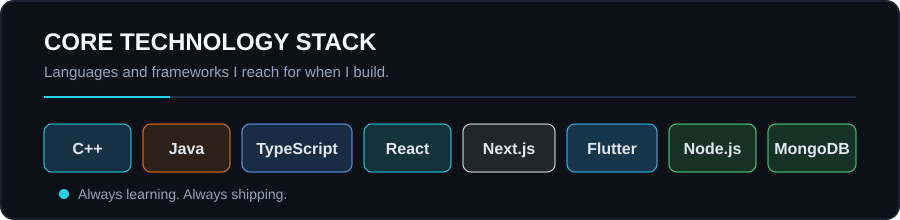
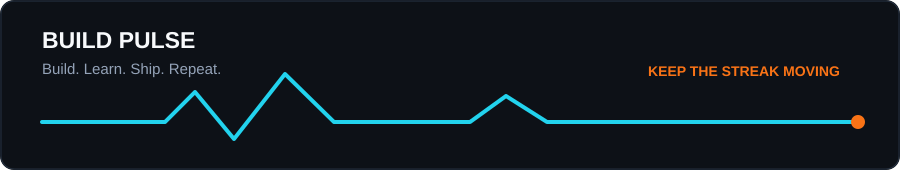

<div align="center">
  

  <a href="https://git.io/typing-svg">
    
  </a>

  <br />
  <br />

  <a href="https://www.linkedin.com/in/samarth-dhage-72a934382/">
    
  </a>
  <a href="mailto:dhagesamarth2027@gmail.com">
    
  </a>
  <a href="https://instagram.com/sam__dhage">
    
  </a>

</div>

<div align="center">
  <br />
  
</div>

## About me

```ts
const samarth = {
  role: "Full-stack developer",
  currentlyExploring: ["Advanced DSA", "System design", "Mobile development"],
  building: "Web and mobile experiences that solve real problems",
  askMeAbout: ["C++", "Java", "React", "Next.js", "Flutter"],
  motto: "Learn deeply. Build boldly."
};
```

- Working across the stack, from polished interfaces to dependable backends.
- Enjoying the satisfying overlap of product building, DSA, and competitive programming.
- Open to thoughtful collaborations and interesting technical conversations.

## Core technology stack

<div align="center">
  
  <br />
  <br />
  
  <br />
  <br />
</div>

<div align="center">
  
  <br />
  <br />
  
  <br />
  <br />
  
</div>

## GitHub activity

<div align="center">
  
</div>

## Contribution trail

<div align="center">
  
</div>

<div align="center">
  <br />
  
  <br />
  <br />
  <i>Thanks for stopping by. Let's build something memorable.</i>
</div>


